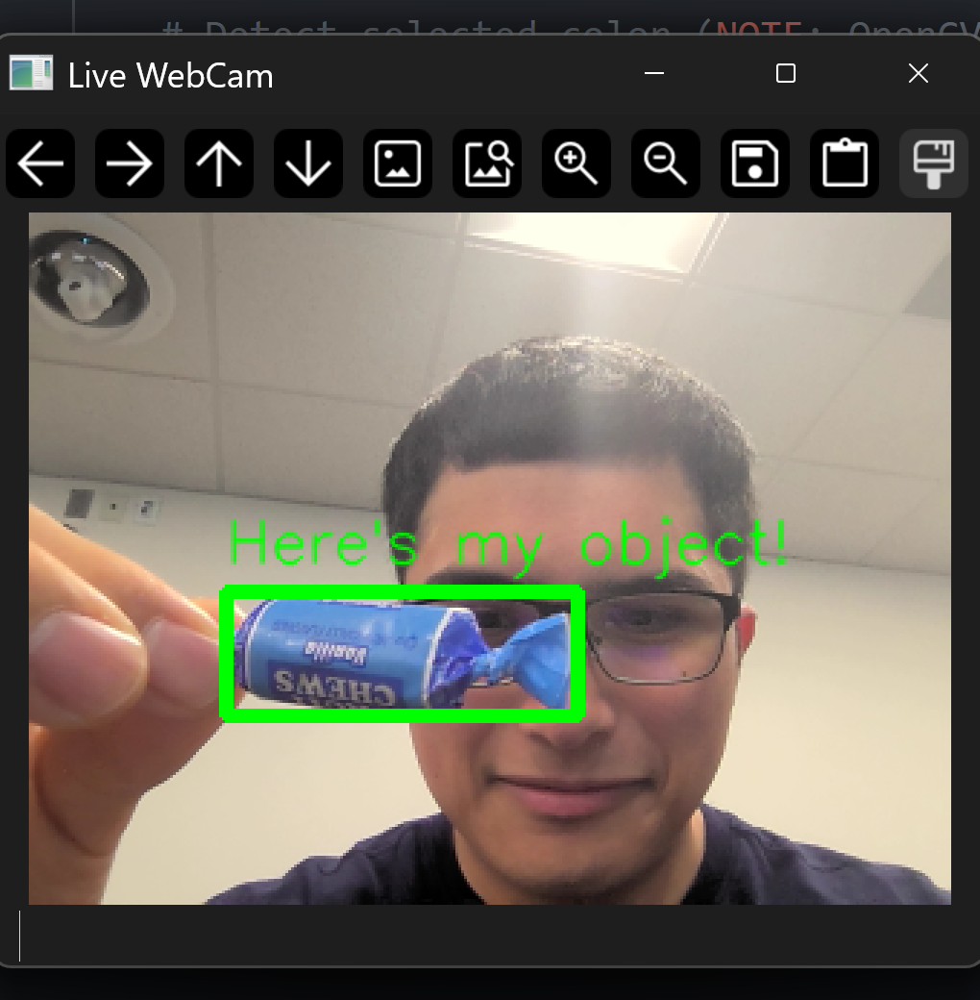
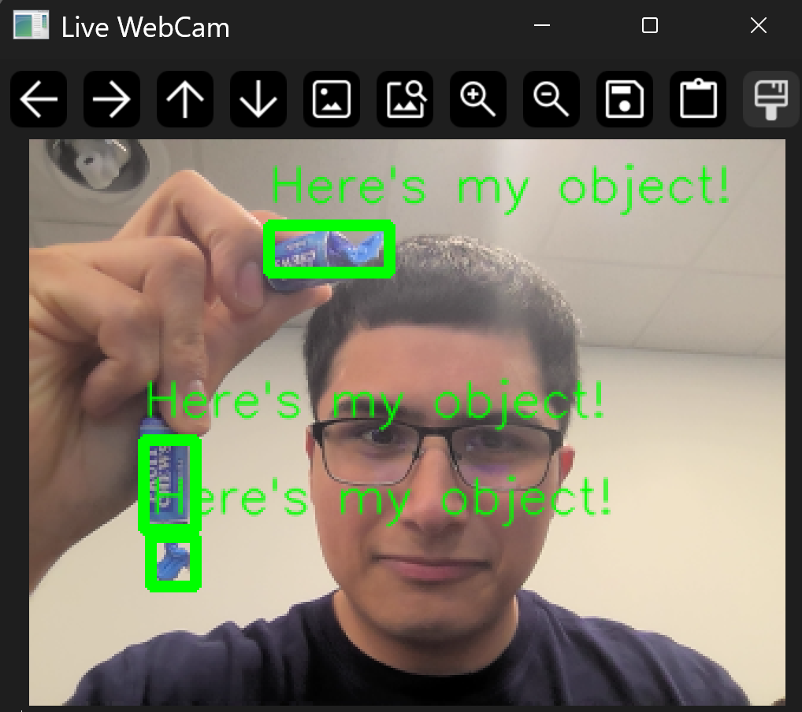
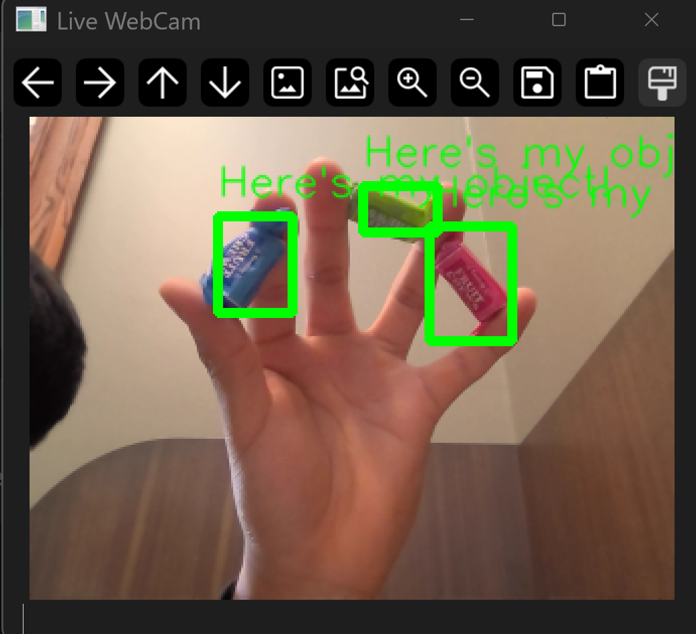

# **Tasks**
## Task 2a

## Task 2b

## Task 2c

## Task 3
Found in `/imgs/Task3.mp4`

# **Questions** 
1.  Check if HSV color space works better. Can you ignore
one or two channels when working in HSV color space
(btw – think how to "ignore” the selected channel)?
If so, why? 
    - **Answer**: It is possible to ignore channels in the HSV space since it separates color information from intensity. Thus, if we want to make our model more robust to changes in lighting and shadows then we could ignore the channels of Saturation and Value. This allows for better detection of colors regardless of how bright or dark it is. 
2.  What happens when you present two objects of the same color to the camera? 
    - **Answer**: Without changing the original code only one object is detected. This is because originally we were only capturing one contour instead of all the contours. 